# Architecture

## Scraping Flow Diagram

```mermaid
sequenceDiagram
    participant Python as scrape.py
    participant Subprocess as curl.exe Process Pool
    participant Szallas as Szallas.hu (Cloudflare)

    Python->>Subprocess: Launch curl.exe for Page 1
    Subprocess->>Szallas: GET page 1
    Szallas-->>Subprocess: 200 OK HTML
    Subprocess-->>Python: Return HTML
    Python->>Python: Parse Page 1 items & total pages (N)
    
    rect rgb(20, 20, 30)
        note right of Python: Fetch remaining pages concurrently
        Python->>Subprocess: Launch curl.exe for Page 2..N (Semaphore-limited)
        Subprocess->>Szallas: GET Page 2..N
        Szallas-->>Subprocess: 200 OK HTML
        Subprocess-->>Python: Return HTML
    end

    Python->>Python: Parse Page 2..N items
    Python->>Python: Aggregate results & print performance stats
```

## Data Schema
Scraped items are formatted as JSON object elements:
- `id`: Unique hotel/accommodation ID.
- `name`: Accommodation name.
- `category`: Category string (e.g. `guest_house`, `apartment`, `pension`).
- `price`: Cleaned price value (float/int).
- `currency`: Currency code (typically `HUF` or `EUR`).
- `rating`: Customer rating (float, 0-10).
- `rating_count`: Number of customer ratings.
- `latitude`: Geospatial latitude coordinates.
- `longitude`: Geospatial longitude coordinates.
